# Qoder Init Flow Diagram

Complete initialization flow for `brief init --tool qoder`

```mermaid
flowchart TD
    Start([User runs: brief init --tool qoder]) --> HasYesFlag{Has --yes flag?}
    
    HasYesFlag -->|Yes| NonInteractive[Non-Interactive Mode]
    HasYesFlag -->|No| CheckTTY{Check TTY Support<br/>canSetRawMode?}
    
    CheckTTY -->|No TTY| NonInteractive
    CheckTTY -->|Has TTY| Interactive[Interactive Mode<br/>Wizard]
    
    %% Interactive Wizard Flow
    Interactive --> WizardDetecting["🔍 Step 1: Detecting<br/>(Spinner)"]
    WizardDetecting --> WizardProjectInfo["📋 Step 2: Project Info<br/>(Show detection results)"]
    WizardProjectInfo --> WizardToolSelect["🛠️ Step 3: Tool Selection<br/>(User selects Qoder)"]
    WizardToolSelect --> WizardTemplateSelect["📄 Step 4: Template Selection<br/>(Auto or manual)"]
    WizardTemplateSelect --> WizardConfirm["✓ Step 5: Confirmation<br/>(Show summary)"]
    WizardConfirm --> WizardGenerating["⚙️ Step 6: Generating<br/>(Spinner)"]
    WizardGenerating --> Detection
    
    %% Non-Interactive Flow
    NonInteractive --> NonInteractiveLog[Log: Detecting project...]
    NonInteractiveLog --> Detection
    
    %% Detection Phase
    Detection["🔍 Detection Phase<br/>detectProject(projectPath)"]
    Detection --> DetectionParallel["Run 8 detectors in parallel:<br/>• detectLanguage()<br/>• detectPackageManager()<br/>• detectFrameworks()<br/>• detectTesting()<br/>• detectDatabase()<br/>• detectBuildTools()<br/>• detectStyling()<br/>• detectAiConfig()"]
    DetectionParallel --> DetectionResult["FullProjectDetection object:<br/>• language: typescript<br/>• frameworks: [next.js, react]<br/>• testing: [jest]<br/>• aiConfig.qoder.*"]
    
    %% Template Selection Phase
    DetectionResult --> TemplateSelection["📝 Template Selection<br/>getQoderTemplates(options)"]
    TemplateSelection --> TemplateLogic["Template Selection Logic:<br/>1. Get all target='qoder' templates<br/>2. If user templates specified:<br/>   • Include those + dependencies<br/>3. Else:<br/>   • filterTemplatesByDetection()<br/>4. Always include core:<br/>   • qoder-core<br/>   • qoder-quick-reference<br/>   • qoder-requirements-spec<br/>   • qoder-settings<br/>5. resolveTemplateDependencies()<br/>6. sortTemplatesByPriority()"]
    TemplateLogic --> TemplateList["Selected Templates:<br/>• qoder-core<br/>• qoder-quick-reference<br/>• qoder-requirements-spec<br/>• qoder-project-info<br/>• qoder-best-practices<br/>• qoder-settings<br/>• qoder-security<br/>• qoder-testing<br/>• qoder-api-design<br/>• typescript<br/>• react<br/>• nextjs"]
    
    %% Generation Phase
    TemplateList --> Orchestrator["⚙️ Generation Phase<br/>runGenerators(options)"]
    Orchestrator --> GetGenerators["getGeneratorsForConfig(['qoder'])"]
    GetGenerators --> GeneratorList["Selected Generators:<br/>• qoderGenerator<br/>• sharedGenerator"]
    
    GeneratorList --> QoderGen["🎯 qoderGenerator.generate()"]
    QoderGen --> QoderContext["createGeneratorContext()<br/>• projectPath<br/>• detection<br/>• config<br/>• dryRun<br/>• mergeMode"]
    QoderContext --> QoderLoop["For each template:<br/>1. renderTemplateWithContext()<br/>   (Handlebars processing)<br/>2. writeGeneratedFile()<br/>   • Check existing file<br/>   • Merge if mergeMode=true<br/>   • Backup if needed<br/>   • Write to disk"]
    
    QoderLoop --> QoderFiles["Generated Qoder Files:<br/>✓ .qoder/rules/core.md<br/>✓ .qoder/rules/quick-reference.md<br/>✓ .qoder/rules/requirements-spec.md<br/>✓ .qoder/rules/project-info.md<br/>✓ .qoder/rules/best-practices.md<br/>✓ .qoder/rules/security.md<br/>✓ .qoder/rules/testing.md<br/>✓ .qoder/rules/api-design.md<br/>✓ .qoder/rules/error-handling.md<br/>✓ .qoder/rules/git-workflow.md<br/>✓ .qoder/rules/architecture.md<br/>✓ .qoder/settings.json"]
    
    QoderFiles --> SharedGen["📚 sharedGenerator.generate()"]
    SharedGen --> SharedFiles["Generated Shared Files:<br/>✓ docs/ARCHITECTURE.md<br/>✓ docs/TECH-STACK.md"]
    
    SharedFiles --> GenerationComplete["GeneratorResult:<br/>• success: true<br/>• files: [...]<br/>• target: 'qoder'"]
    
    %% Post-Generation
    GenerationComplete --> IsInteractive{Interactive Mode?}
    
    IsInteractive -->|Yes| ShowResults["Show Results Component<br/>(Ink UI)<br/>• Success banner<br/>• File list with actions<br/>• Qoder usage guide"]
    IsInteractive -->|No| ShowGuide["showQoderUsageGuide()<br/>(Terminal output)"]
    
    ShowResults --> UsageInfo["📖 Usage Information:<br/>• How to Activate Rules<br/>• 4 Activation Modes:<br/>  - Apply Manually (default)<br/>  - Model Decision<br/>  - Always Apply<br/>  - Specific Files<br/>• Recommended Rules<br/>• Character Limit Warning (100K)"]
    ShowGuide --> UsageInfo
    
    UsageInfo --> ExitSuccess["✅ Exit with success<br/>Configuration ready!"]
    
    %% Styling
    classDef userAction fill:#3b82f6,stroke:#1e40af,color:#fff
    classDef systemProcess fill:#06b6d4,stroke:#0891b2,color:#fff
    classDef dataObject fill:#6b7280,stroke:#374151,color:#fff
    classDef successState fill:#10b981,stroke:#059669,color:#fff
    classDef decision fill:#f59e0b,stroke:#d97706,color:#fff
    
    class Start,HasYesFlag,CheckTTY,IsInteractive userAction
    class Interactive,NonInteractive,Detection,TemplateSelection,Orchestrator,QoderGen,SharedGen systemProcess
    class DetectionResult,TemplateList,GeneratorList,QoderFiles,SharedFiles,GenerationComplete dataObject
    class ExitSuccess successState
    class HasYesFlag,CheckTTY,IsInteractive decision
```

## Flow Explanation

### Entry Point
The user runs `brief init --tool qoder`, which can take two paths:
- **With `--yes` flag**: Goes directly to non-interactive mode
- **Without flag**: Checks for TTY support to enable interactive wizard

### Interactive Mode (Wizard)
A 6-step React/Ink wizard that guides users through:
1. **Detecting**: Analyzes project structure with spinner
2. **Project Info**: Shows what was detected
3. **Tool Selection**: User confirms Qoder selection
4. **Template Selection**: Choose additional templates or use auto-detection
5. **Confirmation**: Review all selections before generation
6. **Generating**: Creates files with progress spinner

### Non-Interactive Mode
Automatically detects project configuration and proceeds with sensible defaults.

### Detection Phase
Runs 8 parallel detectors to analyze:
- Primary/secondary languages
- Package manager (bun, npm, pnpm, yarn)
- Frameworks (Next.js, React, etc.)
- Testing tools (Jest, Vitest, etc.)
- Database/ORM
- Build tools
- Styling solutions
- Existing AI configurations

### Template Selection
`getQoderTemplates()` intelligently selects templates:
1. Gets all templates with `target="qoder"`
2. Includes user-specified templates + dependencies
3. Filters by project detection (framework, language, etc.)
4. Always includes essential core templates
5. Resolves dependencies (e.g., React → TypeScript)
6. Sorts by priority for correct generation order

### Generation Phase
Two generators run sequentially:

**qoderGenerator**:
- Creates `.qoder/rules/*.md` files with YAML frontmatter
- Generates `.qoder/settings.json` with memory/quest config
- Uses Handlebars for template interpolation
- Supports merge mode for existing files

**sharedGenerator**:
- Creates `docs/ARCHITECTURE.md`
- Creates `docs/TECH-STACK.md`

### Post-Generation
Displays usage guidance based on mode:

**Interactive**: Ink UI with formatted results
**Non-Interactive**: Terminal output with color formatting

Both show:
- How to activate rules in Qoder IDE
- 4 activation modes explained
- Recommended rules with suggestions
- 100K character limit warning
- Example usage patterns

## Key Functions

| Function | Purpose |
|----------|---------|
| `initCommand()` | Entry point, routes to interactive/non-interactive |
| `canSetRawMode()` | Checks if terminal supports interactive input |
| `detectProject()` | Orchestrates all project detection |
| `getQoderTemplates()` | Selects templates based on detection + user input |
| `runGenerators()` | Executes qoder + shared generators |
| `renderTemplateWithContext()` | Processes Handlebars templates |
| `writeGeneratedFile()` | Writes files with merge/backup support |
| `showQoderUsageGuide()` | Displays activation instructions |

## Color Legend

- 🔵 **Blue**: User actions and decisions
- 🩵 **Cyan**: System processes and operations
- ⚫ **Gray**: Data objects and results
- 🟢 **Green**: Success states
- 🟠 **Orange**: Decision points

## Files Generated

### Core Rules (Always)
- `core.md` - General coding standards
- `quick-reference.md` - How to use Qoder rules
- `requirements-spec.md` - No TODOs/placeholders policy
- `settings.json` - IDE configuration

### Context-Specific Rules (Based on Detection)
- `security.md` - When auth/APIs detected
- `testing.md` - When test framework detected
- `api-design.md` - When backend/API detected
- `error-handling.md` - Error patterns
- `git-workflow.md` - Git commit standards
- `architecture.md` - System design patterns

### Language/Framework Rules
- Language templates: `typescript.md`, `python.md`, etc.
- Framework templates: `react.md`, `nextjs.md`, etc.

### Shared Documentation
- `docs/ARCHITECTURE.md` - System architecture overview
- `docs/TECH-STACK.md` - Technology stack documentation
